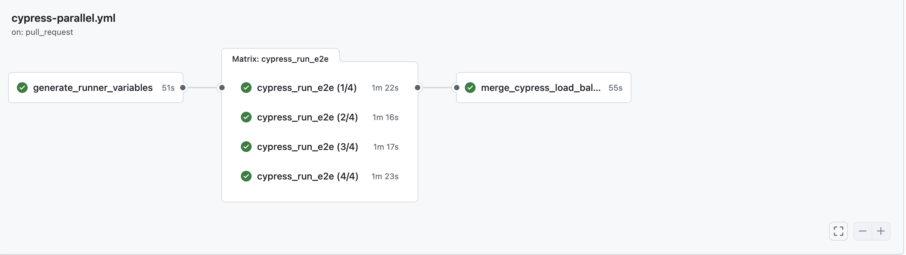

# Using with CI/CD Workflows

I will improve on this documentation later, but for now, this is the main process.

## Running parallelized tests

The process is as such:

- **Generate runner variables:** There are two ways to do this:
  - Use `npx cypress-load-balancer generate-runners <count>`. This creates an array of runner variables to use for
    each parallel runner process to iterated over when selecting which test files to execute.
  - Statically declare an array of runner variables to pass into the parallel runner processes. This removes the need
    for a separate job, but also is harder to update or change dynamically.
- **Parallelized testing jobs:** Create parallelized jobs from the `runner` variables that will execute
  `Cypress run --env runner={X}`,
  where each job will be provided the subset of test files that were organized via the previous load balancing job.
  - If executed previously, download the persistent `.cypress_load_balancer/spec-map.json` file that contains
    previous result runs before running the Cypress processs. This is how load balancing is processed and history is
    maintained.
  - Cypress configurations can be interchanged using their full path set with a Node.js environment variable of
    `process.env.CYPRESS_CONFIG_FILE`.
- **Merge temp maps back to man map:** When all parallelized Cypress jobs complete, collect all of the `spec-map.json`
  files in the
  temporary directory, and run `npx cypress-load-balancer merge -G .cypress_load_balancer/**/spec-map-*.json`. This
  will merge their results back to the persistent mapping object.
  - You may need to restore the main persistent `.cypress_load_balancer/spec-map.json` to this job before beginning
    merging, if it is not available.
    - You can delete the temporary objects with the flag `--rm` in the `merge` command. This only works if the
      temporary
      files exist in the `.cypress_load_balancer` directory.
  - Upload the merged `.cypress_load_balancer/spec-map.json` to a persisted location that can be accessed by
    the next run of this workflow. The results of the tests can now be used by future runs.
  - You may need to separate these maps by repository branch, and only merge them "down" to the trunk branch when
    needed. It is wise to default to the trunk branch's mapping file, if it exists, and only update the trunk's branch
    when either a workflow is run against it, or the current branch is merged down to the trunk, where the trunk
    branch's map can be replaced by one existing in the merged branch's stored location.

This is an example image of what a basic parallelized Cypress testing workflow will look like:

- `generate_runner_variables` creates the `--env runner` inputs
- `Cypress e2e tests (X/Y)` runs the subset of tests in parallel
- `merge_cypress_load_balancing_maps` collects the temporary spec maps and merges them back to the branch's load
  balancing map so new timings are collected.

    ***

## Saving the map from a pull request to the base branch

If running tests on pull requests, then it is important to merge the load balancing map created from it back down to the
map existing on the base branch of the pull request. Then, this merged map can be cached as the one to use for all new
test runs.

For instance,
see [save-map-to-base-branch-on-pr-merge.yml](../.github/workflows/save-map-to-base-branch-on-pr-merge.yml).

This is the general process in GitHub Actions, for example:

- When a pull request (PR) is closed AND also merged, then begin.
- Download the load balancing map saved from the **head branch/branch-being-merged** test run to the folder of
  `.cypress_load_balancer`.
  - _(Note: you must upload the map to that workflow run first!)_
- Restore the main load balancing map from the **base/target** branch to `temp` folder.
- Merge them together using `npx cypress-load-balancer merge -G "./temp/**/spec-map.json"`.
- Save the merged load balancing map to the cache of the **base** branch.
